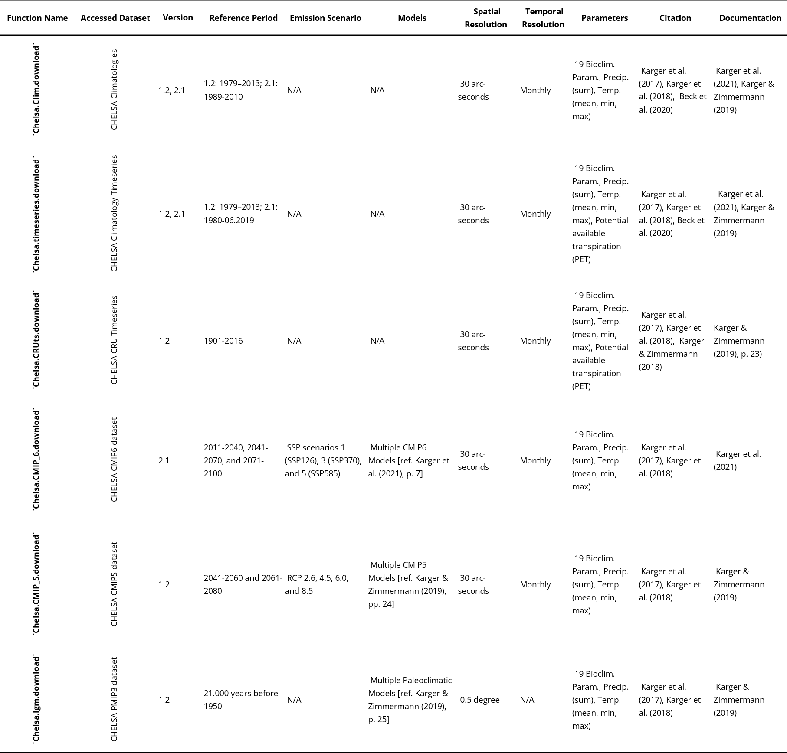
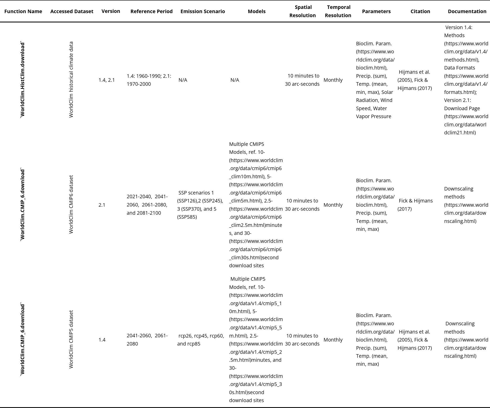

# Summary

Systematical accessing, downloading, and pre-processing climatological data from CHELSA [@karger_Climatologies_2021; @karger_Data_2018; @karger_Climatologies_2017] and WorldClim [@fick_WorldClim_2017; @hijmans_Very_2005] remains a challenge in different environmental disciplines like Species Distribution Modelling (SDM) and climate studies. This package provides a set of functions that allow easy access and customized selection of climate data sets. Besides downloading the raw data, also functionalities to complete pre-processing steps like clipping, rescaling, and file management are available. The applications of the package range from one-time-use to implementing the functions in automatic processing of scientific workflows.

# Statement of need

The climatology datasets CHELSA and WorldClim contribute as crucial data bases for studies in various scientific fields. Primarily used in studies with focus on ecology (\~4,200 publications[^1]), environmental sciences (\>2,200 publications), and biodiversity conservation (\>1,600 publications), usages extend to a wide variety of scientific disciplines. The main usage of the datasets, however, lies in Species Distribution Modelling (SDM) and Ecological Niche Modelling (ENM). Their free availability and frequent citation in widely referenced papers on SDM and ENM strategies [e.g., @RANDIN2020111626; @Zurell.2020] have contributed to their widespread adoption, facilitating comparability between modelling studies at different spatial and temporal scales.

[^1]: Following the Web of Science Categories, citations of @karger_Data_2018 (Data from CHELSA 2.1) had 1,155 citations in the field of Ecology. The WorldClim 2 data [@fick_WorldClim_2017] has 3,044 citations in the same Web of Science category. Both numbers are of the date 17.05.2025. The "Web of Science Categories are assigned at the journal level", meaning the publishing journal defines the category ([source](https://support.clarivate.com/ScientificandAcademicResearch/s/article/Web-of-Science-Core-Collection-Web-of-Science-Categories?language=en_US)).

The high resolution global climatological datasets (30 arc-sec. ~ 1km) include downscaled and bias-corrected data from 30-year time-periods, providing always monthly mean, minimum, and maximum values of temperature and monthly precipitation sums for analysis[^2]. Additionally, [19 bioclimatic parameters](https://www.worldclim.org/data/bioclim.html) are accessible, which enable conclusions about seasonality.

[^2]: Function `Chelsa.timeseries.download` supports also the download of potential evapotranspiration (PET) from CHELSA 2.1 [@karger_Data_2018]

Since their initial releases in 2018 (CHELSA V1.2), the CHELSA [@karger_Climatologies_2017; @karger_Data_2018] datasets were cited in more than 2,800 peer reviewed papers, indexed on the Web of Science ([source, Aug. 2025](https://www.webofscience.com/wos/woscc/summary/1910f819-cfa2-430f-8e84-8882fbb25463-014c01bbb6/date-descending/1)). The latest release of WorldClim 2 in 2017 [@fick_WorldClim_2017] was cited more than 10,600 times ([source, Aug. 2025](https://www.webofscience.com/wos/woscc/summary/97f360a0-0e1e-4bd1-bf33-c34083cb6c8c-014c017f6b/date-descending/1)).

CHELSA and WorldClim datasets are commonly utilized in models predicting the potential past, current, and future distribution of species, particularly in studies on monitoring distribution shifts under climate change [e.g., @bobrowski_Modelling_2017; @twala_Projecting_2023; @werner_Treeline_2025], tracking endangered species and planning conservation strategies [e.g., @Franklin.2013; @Muscatello.2021], assessing the spread of invasive species [@srivastava_Species_2019], and management strategies in forestry and agriculture [e.g., @agbezuge_Application_2024; @PECCHI2019108817].

Recent studies have also assessed the performance of these datasets in SDM/ENM approaches, highlighting their respective strengths and limitations [e.g., @bobrowski_new_2021; @datta_Origin_2020; @MARIA201792; @BOBROWSKI2021109693;@rodriguez-rey_Differing_2024]. Given that dataset performance may vary depending on the research scope, it is recommended to test multiple datasets to to ensure their suitability for the research target and region.

For these applications, `ClimDatDownloadR` offers key advantages by enabling efficient retrieval from both dataset providers and pre-processing steps such as partial selection of parameters, months, and bioclimatic parameters, temporal subsets of timeseries, customized extent, and included file management as well as an output of the provider's respective citation file. In addition to time-saving aspects, the storage usage and management played a key role in the development of the `ClimDatDownloadR`.

The implemented data management creates a hierarchical, clear, and reproducible data structure for analyses during the processing. Downloaded data can be kept as is, deleted, or packed in a zip-archive file. All of raised _ease-of-use_ add-ons contribute to the primary goal of `ClimDatDownloadR` to enable more scientists and other users or organisations to download and pre-process CHELSA and WorldClim data to gain more experience in geodata handling and applications.

Since the official release in 2023, the use of `ClimDatDownloadR` steadily increased [@bobrowski_new_2021;@twala_Projecting_2023;@maitner_global_2023;@Santi_etal_2024;@costa-saura_Are_2025;@werner_Treeline_2025;@chen_PhyloControl_2025]. Further, the need of having software for downloading and pre-processing of freely available data is shown by the steady stream of interested visitors on [ResearchGate (3,399 unique visits, 04.08.2025)](https://www.researchgate.net/publication/370497166_R-package_ClimDatDownloadR_WorldClim_and_CHELSA_download_and_preprocessing), [Zenodo (>1000 views, > 150 downloads)](https://zenodo.org/records/8319614) [@jentsch_ClimDatDownloadR_2023], and citations in peer-reviewed papers.

The package implements the datasets CHELSA V1.2 , V2.1, WorldClim V1.4, and V2.1. More specifically the CHELSA Climatologies, Timeseries, CRU Timeseries (CHELSAcruts), and WorldClim Histclim datasets for present data. For past data, the CHELSA PIMP3 data from CHELSA V1.2 is also available. For future data, both CHELSA and WorldClim provide datasets incorporating various CMIP 5 and 6 global circulation models with various emission scenarios and reference periods. An overview is provided below in [table 1 and 2](#tables).

# Usage

The ClimDatDownloadR enables (1) selection of dataset and version (e.g., CHELSA 2.1), (2) selection of available variable-parameters (e.g., bioclimatic variables and precipitation sums), (3) pre-processing steps like clipping, and (4) file management options. After describing the complete extent of the workflow a working example is shown.
While this introduces an overview on how to approach the usage of the download functions of the `ClimDatDownloadR`, we employ users to consult documentations on the specific functions to gain further insights on e.g., variable or model availability or additional function parameters. An up-to-date version of the manual can be accessed on the [GitHub repository](https://github.com/HelgeJentsch/ClimDatDownloadR/blob/master/ClimDatDownloadR_manual.pdf).

(1) Start selecting the dataset with `provider.dataset.download()`. The _provider_ are `Chelsa` or `WorldClim`. The following _dataset_ completes the function name and specifies the accessed dataset. Function names and accessed datasets are referenced in the leading columns of [table 1 and 2](#tables). The version can be specified with `version.var`.
(2) The availability of parameters differs between datasets, despite every dataset providing data on monthly temperature means, minima, and maxima, as well as precipitation sums. Bioclimatic variables are also available for all climatologies. Here, the function parameters `month.var` and `bio.var` can be used to specify a subset from the dataset. For past (last glacial maximum) and future (CMIP 5/6) model climatologies a set of function parameters to specify models (`model.var`), scenarios (`emission.scenario.var`), and time interval (`time.interval.var`) can be used.
The WorldClim datasets come in different spatial resolutions (10/5/2.5 arc-min., 30 arc-sec.), while CHELSA data is always in 30 arc-sec. resolution. Therefore, `WorldClim.*.download()`-functions have an additional `resolution` function parameter.
(3) The pre-processing steps consist of two levels. While the processing of the provided data to interpretable values cannot be addressed by the user, clipping needs to be enabled with the eponymous function parameter and specified further with parameters like `clip.shapefile` or `clip.extent` with `buffer` as additional parameter.
(4) File-management addresses the conversion to different file formats, the decluttering of the working directory, and a citation file that includes the providers' relevant publications. Currently, the functions parameter `convert.files.to.asc` and `stacking.data` convert the data to ASCII raster and netCDF format, respectively.
For a storage efficient way, the user can decide to delete the downloaded datasets (`delete.raw.data`), save them in a zip-archive file (`combine.raw.zip` (CHELSA), `keep.raw.zip` (WorldClim)), or keep them in the directory as-is. The function parameter `save.bib.file` adds a citation file of the publications from the data provider to the working directory for convenience.

In the following, the basic usage of the download functions are demonstrated by applying an example call of the `Chelsa.Clim.download()` function, aiming at downloading CHELSA V2.1 bioclimatic and precipitation data, with clipping to the European continent's extent, and file management tools:

<!-- prettier-ignore -->
```r
ClimDatDownloadR::Chelsa.Clim.Download(  
  save.location = "./",  
  version.var = "2.1",  
  parameter = c("bio", "prec"),  
  month.var = c(4:9),  
  clipping = TRUE,  
  clip.extent = c(-5,25,40,62),  
  buffer = 0,  
  clip.shapefile = NULL,  
  convert.files.to.asc = FALSE,  
  stacking.data = FALSE,  
  combine.raw.zip = TRUE,  
  delete.raw.data = TRUE,  
  save.download.table = TRUE,  
  save.bib.file = TRUE  
)
```

\pagebreak

# Tables

**Table 1**: Overview of the CHELSA function names, the respective accessible dataset, versions, spatial and temporal resolutions, as well as the reference periods, and if applicable emission scenarios and models. Additionally the citations and links to the documentations of the datasets are listed.

{width="375pt" label="tab1"}
\pagebreak

**Table 2**: Overview of the WorldClim functions. Similar to [table 1](#tables).

{width="375pt" label="tab2"}

# Acknowledgements

We acknowledge the thorough testing efforts by the co-authors and Nadine Kaul, and the open access efforts by the Eidg. Forschungsanstalt für Wald, Schnee und Landschaft WSL [Chelsa; @karger_Climatologies_2017] and University of California, Davis [WorldClim; @fick_WorldClim_2017] working groups. Also we want to acknowledge the wide user group that implemented the `ClimDatDownloadR` in their unpublished scientific work or motivated us to implement new datasets or update broken links.
In addition we want to thank the developers of the various `R`-packages for their contributions that made this package possible. In alphabetical order these were: `curl` [@ooms_curl_2025], `httr` [@wickham_httr_2023], `ncdf4` [@pierce_ncdf4_2024], `RCurl` [@templelang_RCurl_2025], `RefManageR` [@mclean_Straightforward_2014; @mclean_RefManageR_2017], `sf` [@pebesma_Simple_2018; @pebesma_Spatial_2023], `stringr` [@wickham_stringr_2023], `sp` [@bivand_Applied_2013; @pebesma_Classes_2005], `terra` [@hijmans_terra_2025], and the development team of `R` [@rcoreteam_language_2025].

<!-- CMIP5/6 Acknowlegements [We acknowledge the World Climate Research Programme, which, through its Working Group on Coupled Modelling, coordinated and promoted CMIP6. We thank the climate modeling groups for producing and making available their model output, the Earth System Grid Federation (ESGF) for archiving the data and providing access, and the multiple funding agencies who support CMIP6 and ESGF](https://pcmdi.llnl.gov/CMIP6/TermsOfUse/TermsOfUse6-1.html) ... from [WorldClim2 Future Climate](https://www.worldclim.org/data/cmip6/cmip6climate.html) -->

# References

<!--
<!-- prettier-ignore
| Function Name | Accessed Dataset | Version  | Reference Period | Emission Scenario | Models | Spatial Resolution | Temporal Resolution | Parameters | Citation | Documentation |
| --- | --- | --- | --- | --- | --- | --- | --- | --- | --- | --- |
| `Chelsa.Clim.download` | CHELSA Climatologies | 1.2, 2.1 | 1.2: 1979–2013; 2.1: 1989-2010 | N/A | N/A | 30 arc-seconds | Monthly | 19 Bioclim. Param., Precip. (sum), Temp. (mean, min, max) | @karger_Climatologies_2017,  @karger_Data_2018,  @beck_Bias_2020 | @Chelsa_2.1_techRep, @Chelsa_1.2_techRep |
| `Chelsa.timeseries.download`   | CHELSA Climatology Timeseries | 1.2, 2.1 | 1.2: 1979–2013; 2.1: 1980-06.2019 | N/A | N/A | 30 arc-seconds | Monthly | 19 Bioclim. Param., Precip. (sum), Temp. (mean, min, max), Potential available transpiration (PET) | @karger_Climatologies_2017, @karger_Data_2018, @beck_Bias_2020  |  @Chelsa_2.1_techRep, @Chelsa_1.2_techRep |
| `Chelsa.CRUts.download`   | CHELSA CRU Timeseries | 1.2 | 1901-2016 | N/A | N/A | 30 arc-seconds | Monthly | 19 Bioclim. Param., Precip. (sum), Temp. (mean, min, max), Potential available transpiration (PET) | @karger_Climatologies_2017, @karger_Data_2018, @karger_CHELSAcruts_2018 | (@Chelsa_1.2_techRep, p. 23) |
| `Chelsa.CMIP_6.download` | CHELSA CMIP6 dataset | 2.1 | 2011-2040, 2041-2070, and 2071-2100 | SSP scenarios 1 (SSP126), 3 (SSP370), and 5 (SSP585) | Multiple CMIP6 Models [ref. @Chelsa_2.1_techRep, p. 7] | 30 arc-seconds | Monthly | 19 Bioclim. Param., Precip. (sum), Temp. (mean, min, max) | @karger_Climatologies_2017, @karger_Data_2018 | @Chelsa_2.1_techRep |
| `Chelsa.CMIP_5.download` | CHELSA CMIP5 dataset | 1.2 | 2041-2060 and 2061-2080 | RCP 2.6, 4.5, 6.0, and 8.5 | Multiple CMIP5 Models [ref. @Chelsa_1.2_techRep, pp. 24] | 30 arc-seconds | Monthly | 19 Bioclim. Param., Precip. (sum), Temp. (mean, min, max) | @karger_Climatologies_2017, @karger_Data_2018 | @Chelsa_1.2_techRep |
| `Chelsa.lgm.download` | CHELSA PMIP3 dataset | 1.2 |  21.000 years before 1950 | N/A | Multiple Paleoclimatic Models [ref. @Chelsa_1.2_techRep, p. 25] | 0.5 degree | N/A | 19 Bioclim. Param., Precip. (sum), Temp. (mean, min, max) | @karger_Climatologies_2017, @karger_Data_2018 | @Chelsa_1.2_techRep |
| `WorldClim.HistClim.download`  | WorldClim historical climate data | 1.4, 2.1 | 1.4: 1960-1990; 2.1: 1970-2000 | N/A | N/A |  10 minutes to 30 arc-seconds | Monthly | [Bioclim. Param.](https://www.worldclim.org/data/bioclim.html), Precip. (sum), Temp. (mean, min, max), Solar Radiation, Wind Speed, Water Vapor Pressure | @hijmans_Very_2005, @fick_WorldClim_2017 | Version 1.4: [Methods](https://www.worldclim.org/data/v1.4/methods.html), [Data Formats](https://www.worldclim.org/data/v1.4/formats.html); Version 2.1: [Download Page](https://www.worldclim.org/data/worldclim21.html) |
| `WorldClim.CMIP_6.download` | WorldClim CMIP6 dataset | 2.1 | 2021-2040,  2041-2060,  2061-2080, and 2081-2100 | SSP scenarios 1 (SSP126),2 (SSP245), 3 (SSP370), and 5 (SSP585) | Multiple CMIP5 Models, ref. [10-](https://www.worldclim.org/data/cmip6/cmip6_clim10m.html), [5-](https://www.worldclim.org/data/cmip6/cmip6_clim5m.html), [2.5-](https://www.worldclim.org/data/cmip6/cmip6_clim2.5m.html)minutes, and [30-](https://www.worldclim.org/data/cmip6/cmip6_clim30s.html)second download sites | 10 minutes to 30 arc-seconds| Monthly | [Bioclim. Param.](https://www.worldclim.org/data/bioclim.html), Precip. (sum), Temp. (mean, min, max) | @fick_WorldClim_2017 | [Downscaling methods](https://www.worldclim.org/data/downscaling.html) |
| `WorldClim.CMIP_6.download` | WorldClim CMIP5 dataset| 1.4 | 2041-2060,  2061-2080 | rcp26, rcp45, rcp60, and rcp85 | Multiple CMIP5 Models, ref. [10-](https://www.worldclim.org/data/v1.4/cmip5_10m.html), [5-](https://www.worldclim.org/data/v1.4/cmip5_5m.html), [2.5-](https://www.worldclim.org/data/v1.4/cmip5_2.5m.html)minutes, and [30-](https://www.worldclim.org/data/v1.4/cmip5_30s.html)second download sites  | 10 minutes to 30 arc-seconds | Monthly | [Bioclim. Param.](https://www.worldclim.org/data/bioclim.html), Precip. (sum), Temp. (mean, min, max) | @hijmans_Very_2005, @fick_WorldClim_2017 | [Downscaling methods](https://www.worldclim.org/data/downscaling.html) |
-->
